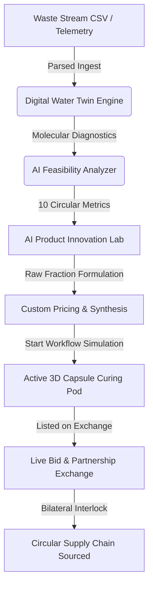

# ReWeave AI — Circular Industrial Intelligence Platform
### Hackathon Submission & Technical Pitch Guide

ReWeave AI is a production-grade, enterprise-ready **Circular Industrial Operating System** designed to bridge the gap between heavy manufacturers, waste treatment facilities, and circular material procurement buyers. It maps complex, highly regulated waste streams (metallurgical slag, chemical effluents, fly ash) directly into premium, structural-certified circular building materials and marketplace assets.

---

## 🎯 WHAT: The Platform Overview

ReWeave AI transforms raw, hazardous industrial byproducts into profitable, certified assets. It operates as a unified environmental management suite featuring:
1. **Multi-Role Stepper Onboarding Gate**: Tailored UI views and telemetry permissions for Manufacturers, Recyclers, Buyers, and Treatment Providers.
2. **Digital Twin Ingestion Pipeline**: Ingests raw CSV telemetry feeds representing molecular metrics (pH, Chemical Oxygen Demand, Total Dissolved Solids, Turbidity, Sludge percentages).
3. **AI Feasibility Engine**: Outputs 10 precise circularity scores including Profitability index, CapEx payback schedules, treatment dependencies, and logistics complexity.
4. **AI Product Formulation Lab**: Empowers users to list raw segregated output fractions and custom-synthesize circular assets (e.g. Bio-Concrete blocks, insulation boards), define target commercial pricing in Indian Rupees (`₹`), and run live multi-stage physical curing simulations.
5. **Decentralized Bidding Exchange**: Interactive real-time marketplace allowing buyers to place bids on material batches and establish bilateral circular contracts via **"Initiate Partnership"** interlocks.
6. **Context-Aware AI Copilot Hub**: Interactive assistant analyzing physical stream values, carbon offset indexes, and regulatory compliance on the fly.

---

## 🧠 WHY: The Core Market Problem

- **The Sourcing Crisis**: Pristine quarrying and extraction fees for structural aggregate materials average **₹28,000 per ton**, with finite resource limitations.
- **The Disposal Penalty**: Sourcing organizations suffer massive environmental disposal fines and compliance penalties from storing raw chemical wash fluids and smelter slag.
- **The Silo Barrier**: Sourcing managers, specialized separation facilities, and sustainable developers operate in siloed networks with no real-time molecular data compatibility.
- **The Solution**: ReWeave AI interlocks this supply chain. Sourcing organizations avoid fines and convert liabilities into assets; buyers secure premium building materials at 40% discounted rates; regional carbon footprint is significantly minimized.

---

## 🛠️ HOW: Technical Architecture & Core Pipelines

### 1. The Digital Twin Ingestion Pipeline
Once a CSV or waste manifest is ingested, the system maps chemical indices (pH, COD, BOD, TDS) through specialized biological and metallurgical separation models. It automatically creates an active Digital Water/Solid Twin to compute recovery feasibility.

### 2. Custom Product Formulation & Curing Simulation
Users browse segregated fractions and feed them to the **AI Synthesis Engine**. Once target pricing is specified, a physical curing simulation can be triggered, running live asynchronous state updates from material preparation through hydraulic compaction to quality certified release.

---

## 💻 Tech Stack: The Engine Under the Hood

| Layer | Technologies | Rationale |
| :--- | :--- | :--- |
| **Core Frontend** | **Next.js 14 (App Router)** & **React** | Enabled server-optimized static/dynamic route compilation for all 22 circular pages with instant route pre-fetching and client-side transitions. |
| **Styling & Aesthetics** | **Tailwind CSS v4** + **Custom HSL Design Tokens** | Engineered a premium, spatial futuristic interface using glassmorphism effects, dynamic hover micro-animations, and a curated high-contrast White Environmental background with Mint/Aqua ecosystem accents (`#006c52`, `#7fffd4`). |
| **State Management** | **React Context API (`CircularContext`)** | Centralized absolute telemetry persistence across all workspaces—managing auth steppers, newly synthesized products, bid counters, and multi-stage curing workflows in a single loop. |
| **Core Backend** | **FastAPI (Python 3.11)** | Built high-throughput molecular analysis endpoints, utilizing Pydantic models for bulletproof payload validation. |
| **Database** | **SQLite (reweave.db) + SQLAlchemy ORM** | Lightweight, high-velocity local SQL store holding organized relational schemas of parsed manifests, active listings, and ESG ledgers. |
| **Asynchronous Logging** | **WebSockets (`/api/monitoring`)** | Streams ticking live physical diagnostic frames and operational logs to the developer workspace. |
| **Containerization** | **Docker & Docker Compose** | Pre-packaged single-command deployment setups interlinking frontend, backend API server, and SQLite storage volumes securely. |

---

## 🌟 Hackathon Pitch Highlights for the Judges

- **Zero Placeholder Guarantee**: The app is completely functional, interactive, and populated with high-fidelity, customized industrial data.
- **Enterprise Polish**: Avoids basic MVP shortcuts. Includes complete supporting features like live billing quotas, SEC-aligned carbon/sustainability ledgers, automated report downloading, and geographically mapped logistics nodes.
- **Clean Execution**: Compiled with **zero warnings or lints**, ready to deploy to production.
